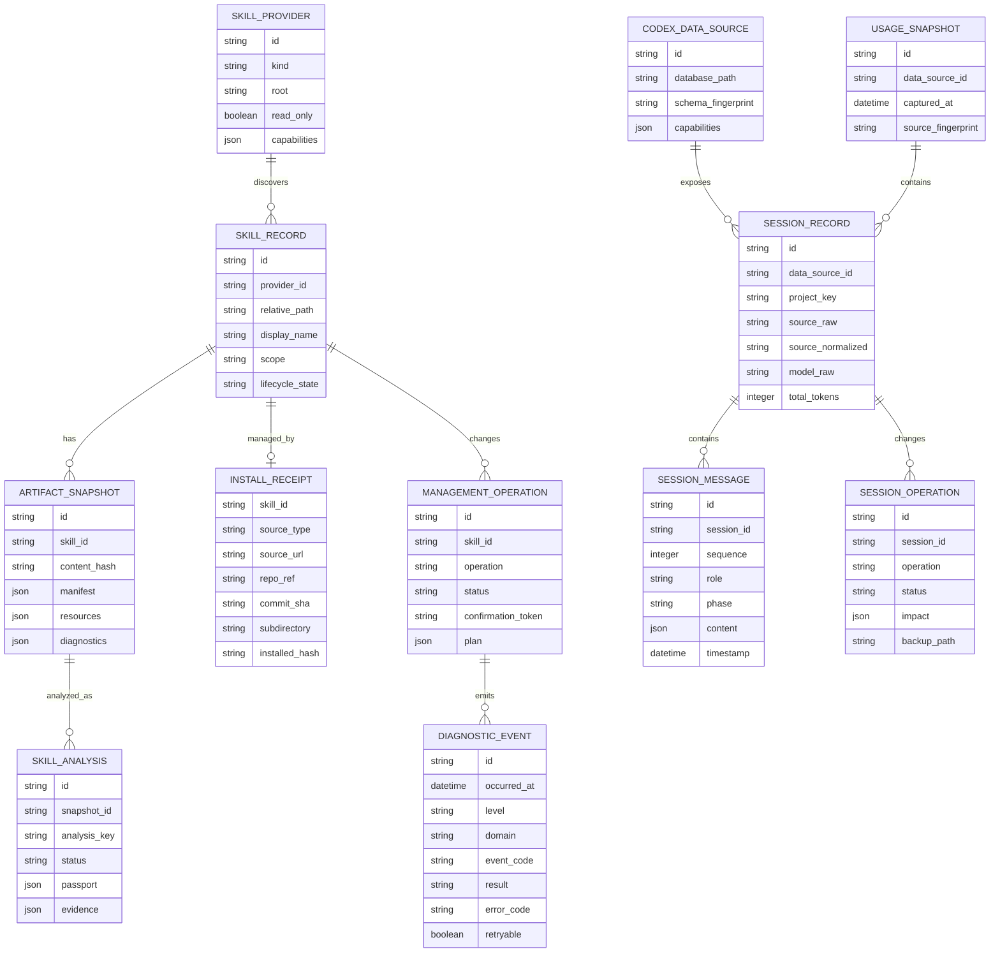
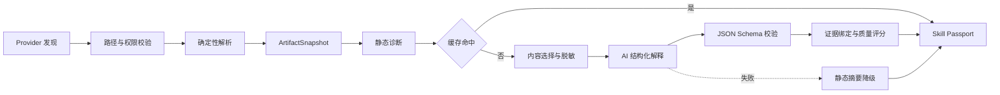

# Codex-O 产品蓝图与领域模型

**版本**：v1.0-draft  
**日期**：2026-07-29
**状态**：新版 PRD、技术设计和实施计划的上游基线  
**原型基线**：`prototype/`，保留现有 9 页信息架构，不在本轮重做视觉

---

## 1. 一句话定义

Codex-O 是一个本机优先的 Codex Skill 智能解析与资产管理工具，并提供 Codex 会话管理和 Token 使用洞察。

它解决三个连续问题：

1. **看见**：用户当前有哪些 Skill，它们来自哪里、是否可操作。
2. **看懂**：Skill 会做什么、何时触发、如何使用、依赖什么、有哪些风险。
3. **管好**：只对来源明确且具备写权限的 Skill 提供安装、隔离、恢复和更新。

会话与 Token 是独立能力域。常规查询保持只读；只有经过兼容性检测、影响预览和用户确认的会话删除操作可以写入 Codex 状态库。

---

## 2. 产品判断

### 2.1 核心价值

核心价值不是“把英文翻译成中文”，而是建立一层可追溯的 **Skill Intelligence**：

- 多来源发现
- 确定性结构解析
- AI 人类化解释
- 证据与置信度
- 安全能力边界
- 来源与更新追踪
- Codex 版本兼容

### 2.2 产品边界

Codex-O 由两个相对独立的产品域组成：

| 产品域 | 目标 | 默认权限 |
|---|---|---|
| Skill Intelligence & Management | 发现、理解、比较和管理 Skill | 读取全部已知来源；仅写入受管 User Skill |
| Codex Sessions & Usage | 完整预览、下载、删除会话并分析 Token | 查询只读；删除走独立受控写入协议 |

两个产品域共享桌面应用外壳、设置、诊断与日志、导出和错误模型，但不共享数据写入逻辑。

### 2.3 设计原则

1. **事实先于 AI**：路径、元数据、文件、脚本、依赖等信息由解析器提取，AI 不负责猜测事实。
2. **解释必须可追溯**：AI 结论附带证据位置、置信度和不确定性。
3. **权限来自 Provider**：是否允许安装、更新或隔离，由 Skill 来源能力决定，不由前端按钮决定。
4. **只读优先、删除例外**：Codex 状态库的列表、预览和统计只读；会话删除必须备份并通过独立事务执行。
5. **不伪造精度**：只有总 Token 时，不拆分输入/输出，不给出精确费用。
6. **兼容变化**：内部 SQLite 表、来源值和模型名均视为可变输入，不写死值域。
7. **原型是交互参考，不是范围承诺**：页面可以提前存在，危险操作只有在能力和安全设计完成后才启用。
8. **可诊断但不泄密**：失败必须有稳定错误码、事件 ID 和恢复建议；开发者模式只控制日志可见性和诊断粒度，不放宽脱敏或文件权限。

---

## 3. 目标用户与核心任务

### 3.1 主要用户

- 已安装多个 Skill 的 Codex 深度用户
- 维护团队级或仓库级 Skill 的开发者
- 希望了解 Skill 能力但不愿阅读长篇说明的新用户

### 3.2 核心任务

| 任务 | 用户需要得到的答案 |
|---|---|
| 浏览 Skill | 我当前有哪些 Skill，哪些会在这个仓库生效？ |
| 理解 Skill | 它做什么、怎么触发、需要什么、可能影响什么？ |
| 比较 Skill | 两个相似 Skill 的适用边界有什么不同？ |
| 管理 Skill | 我能否安全安装、隔离、恢复或更新它？ |
| 查看会话 | Codex 在这个会话中，用户和助手完整说过什么？ |
| 管理会话 | 如何下载原始会话，并安全删除不再需要的会话？ |
| 查看 Token | Token 消耗集中在哪些时间、项目、模型和会话？ |

---

## 4. 分阶段产品范围

### 4.1 M1：看见与看懂

首个可用版本，建立 Skill Intelligence 基础。

- 多 Provider Skill 发现
- SKILL.md、`agents/openai.yaml` 和资源目录解析
- Skill 列表、搜索、筛选和详情
- Skill 护照
- AI 中文解释、缓存和降级
- 相似 Skill 基础对比
- AI Provider 配置和系统安全存储

不包含任何永久删除、自动更新或 Codex 会话写操作。

### 4.2 M2：可控管理

- 开发者模式与本地诊断日志中心
- 本地文件或目录导入 User Skill
- 安装来源凭据
- 预检计划、确认令牌、执行三段式写操作
- 隔离到 Codex-O 自有 quarantine
- 从 quarantine 恢复
- GitHub 和市场来源安装
- 来源明确时检查更新和执行更新

“禁用”不作为抽象开关实现。只有验证 Codex 实际发现规则后，才能映射为具体文件操作。

### 4.3 M3：会话管理与使用洞察

- 发现可用的 `state_*.sqlite`
- 会话列表、项目分组、详情和搜索
- 完整对话预览：按时间展示用户与助手的每一条可见消息
- 助手消息区分过程更新和最终回答
- Token 总览、趋势、项目/模型/来源分布
- Subagent 和复合来源归一化
- SQLite 快照
- CSV/JSON 导出
- 原始 rollout JSONL 受控下载
- 会话删除影响预览
- 会话回收站、恢复和永久清理

### 4.4 v1.0：稳定整合

- 完成兼容性矩阵
- 完成跨平台验证
- 完成 Skill 分析质量评测
- 完成安装和更新回滚测试
- 将 M1、M2、M3 整合为首个稳定版本

### 4.5 v1.x 后续候选

- Plugin 级管理
- MCP 配置管理
- Skill 质量诊断和改进建议
- Skill 使用频率研究
- 批量会话删除

---

## 5. 现有原型映射

现有 9 页全部保留，调整能力状态：

| 原型页面 | 新版定位 | 首次启用版本 |
|---|---|---|
| 我的 Skills | 多 Provider Skill 总览 | M1 |
| Skill 详情 | Skill 护照、证据、风险与原文 | M1 |
| Skill 市场 | 可安装来源浏览 | M2 |
| 安装 Skill | 本地/GitHub/市场安装 | M2 |
| 更新中心 | 仅展示有 InstallReceipt 的可更新项 | M2 |
| 会话管理 | 完整对话预览、搜索、下载、删除和恢复 | M3 |
| Token 统计 | 使用量分析，不做账单级费用 | M3 |
| 设置 | AI、扫描根目录、隐私、兼容状态；M2-S0 增加开发者模式和诊断日志 | M1 |
| MCP 管理 | 路线图占位 | v1.x 后续 |

原型需要在实现阶段调整的关键点：

- Skill 来源从“本地/GitHub/市场/未知”改为 Provider + 安装来源两个维度。
- Skill 详情从三要素升级为 Skill 护照。
- “卸载”改为“隔离”，恢复后再提供永久删除入口。
- 会话页将原始 JSONL 前几行改为完整用户/助手对话流。
- 保留原始 rollout 下载，并提供带影响范围的删除确认。
- 删除后进入 Codex-O 会话回收站，避免直接永久丢失。
- Token 详情不得展示不存在的输入/输出拆分。
- 费用估算默认不展示；只有用户配置明确口径后才启用。
- 设置页使用“常规设置 / 诊断与日志”二级视图；开发者模式关闭时不展示日志入口。

---

## 6. 领域模型总览



---

## 7. 核心实体

### 7.1 SkillProvider

描述一个 Skill 发现来源和它允许的操作。

建议 Provider 类型：

- `user_global`：全局用户 Skill
- `repo`：当前仓库 `.agents/skills`
- `system`：Codex 内置 Skill
- `plugin`：插件提供的 Skill
- `bundled`：应用或运行时附带 Skill
- `additional_root`：用户手动添加的只读根目录

Provider 必须声明能力：

```text
can_read
can_import
can_quarantine
can_restore
can_update
can_delete
```

默认除 `user_global` 外均只读。

### 7.2 SkillRecord

表示某个 Provider 中发现的一次实际安装。

约束：

- `name` 不是主键。
- 同名 Skill 可以存在于多个 Provider 或路径。
- ID 由 `provider_id + normalized_relative_path` 稳定生成。
- 绝对路径仅在 Rust 内部使用，不通过列表 DTO 暴露。

### 7.3 ArtifactSnapshot

表示一次确定性的 Skill 内容快照。

包含：

- frontmatter
- Markdown 标题结构
- `agents/openai.yaml`
- scripts/references/assets 清单
- 文件大小和 hash
- 静态诊断
- 外部引用
- 潜在网络、命令和文件操作提示

### 7.4 SkillAnalysis

表示对某个 ArtifactSnapshot 的人类化解释。

分析身份：

```text
content_hash
parser_version
prompt_version
schema_version
provider
model
language
```

任一项变化都产生新的 analysis key。

### 7.5 SkillPassport

SkillAnalysis 的用户可见主体：

| 字段 | 含义 |
|---|---|
| summary | 一句话说明 |
| capabilities | 能帮助 Codex 完成什么 |
| trigger_examples | 用户可以怎么说 |
| suitable_when | 适用场景 |
| avoid_when | 不适用场景 |
| workflow | 主要执行步骤 |
| prerequisites | 依赖、配置和前置条件 |
| resources | scripts/references/assets |
| side_effects | 网络、文件、命令和外部系统影响 |
| risks | 安全、隐私和误操作风险 |
| related_skills | 相似 Skill 与差异 |
| confidence | 分析置信度 |
| evidence | 对应文件与行号 |

### 7.6 InstallReceipt

仅对 Codex-O 管理或来源可确认的 Skill 建立。

没有 InstallReceipt 的 Skill：

- 可以读取和分析
- 不显示“可更新”
- 不允许自动覆盖
- 隔离前需要更强提示

### 7.7 ManagementOperation

所有写操作使用统一三段式：

1. `plan`：后端生成影响范围和确认令牌。
2. `confirm`：前端展示计划，用户确认。
3. `execute`：后端校验令牌、路径和当前快照后执行。

执行前后都记录操作结果，但日志不保存 Skill 正文或用户绝对路径。

### 7.8 DiagnosticEvent

表示一次经过 Rust 安全边界规范化的本地诊断事件。

- 日志始终按脱敏字段采集，开发者模式默认关闭。
- 开发者模式关闭时，前端日志查询、导出和清空能力由 Rust 拒绝，不只隐藏按钮。
- 事件包含稳定事件 ID、级别、领域、事件码、结果、耗时、错误码、是否可重试和恢复建议。
- 日志写入应用专属日志目录和有界内存缓冲，不写入 Codex-O SQLite 或 `~/.codex`。
- 不保存自由文本异常、Prompt、AI 原始响应、Skill/会话正文、密钥、令牌、环境变量值或用户绝对路径。
- 日志目录不可用时应用继续运行，诊断能力降级到当前进程的内存缓冲。

### 7.9 CodexDataSource

表示一个可读取的 Codex 状态数据库。

职责：

- 发现 `state_*.sqlite` 或配置指定数据库
- 读取 `PRAGMA table_info`
- 计算 schema fingerprint
- 标记必需列、可选列和不可用能力
- 只读连接

### 7.10 SessionRecord

保留原始字段和归一化字段：

- `source_raw` 保留数据库原值
- `source_normalized` 映射为 desktop/cli/exec/subagent/other
- `model_raw` 保留代理商前缀
- `model_family` 仅在规则明确时推导
- `total_tokens` 不拆分输入和输出
- `rollout_fingerprint` 用于预览、下载和删除前的并发校验
- `parent_thread_id` 和 `child_thread_ids` 用于展示 Subagent 关联影响

### 7.11 SessionMessage

从 rollout JSONL 中解析出的可见对话消息：

- `event_msg.user_message` 映射为用户消息
- `event_msg.agent_message` 映射为助手消息
- 助手 `phase` 区分 commentary 和 final_answer
- `response_item.message` 作为兼容性回退来源
- 按 JSONL 行顺序展示，不按时间戳重新排序
- developer、reasoning、tool call 默认不显示
- 重复事件按事件 ID 或角色、文本 hash 和邻近位置去重

预览必须展示用户和助手的全部可见消息，不只展示首条消息或 JSONL 前几行。

### 7.12 SessionOperation

会话删除与恢复使用独立操作模型：

1. 预检会话行、rollout 文件和关联表。
2. 展示文件大小、关联 Subagent 和将删除的数据库记录。
3. 将 rollout 和完整数据库行备份到 Codex-O 会话回收站。
4. 在事务中删除关联行和 threads 主记录。
5. 删除失败时恢复文件并回滚事务。
6. 回收站内容支持恢复和二次永久清理。

### 7.13 UsageSnapshot

统计和导出基于快照，避免报表生成期间源库变化。

快照包含：

- 捕获时间
- 数据库 fingerprint
- 会话数量
- 查询口径
- 归一化版本

---

## 8. 状态模型

### 8.1 Skill 生命周期

```text
discovered
  -> indexed
  -> valid | invalid
  -> active | read_only | quarantined | missing
```

### 8.2 AI 分析状态

```text
not_requested
pending
running
ready
stale
failed
degraded
```

### 8.3 管理操作状态

```text
planned
confirmed
running
succeeded
failed
rolled_back
expired
```

### 8.4 会话删除状态

```text
planned
blocked_active
confirmed
moving_to_trash
deleting_index
succeeded
failed
rolled_back
restored
purged
```

---

## 9. Skill 解析流水线



AI 输入必须：

- 明确 Skill 内容是待分析数据，不是系统指令
- 去除明显密钥和敏感环境变量值
- 默认不发送全部 references 和 scripts 内容
- 展示将发送的内容范围
- 允许本地模型模式

---

## 10. 权限矩阵

| 来源 | 读取 | AI 分析 | 隔离 | 恢复 | 更新 | 永久删除 |
|---|---:|---:|---:|---:|---:|---:|
| User Global，Codex-O 受管 | 是 | 是 | 是 | 是 | 有凭据时 | 从 quarantine |
| User Global，未知来源 | 是 | 是 | 二次确认 | 是 | 否 | 从 quarantine |
| Repo | 是 | 是 | 否 | 否 | 否 | 否 |
| System | 是 | 是 | 否 | 否 | 否 | 否 |
| Plugin/Bundled | 是 | 是 | 否 | 否 | 交给 Plugin 管理 | 否 |
| Additional Root | 是 | 是 | 否 | 否 | 否 | 否 |

---

## 11. 质量指标

### 11.1 Skill Intelligence

- 首屏 3 秒内展示已发现 Skill，不等待 AI。
- 缓存命中时 3 秒内展示 Skill Passport。
- 结构化解析覆盖率不低于 95%。
- AI 输出 JSON Schema 有效率不低于 99%。
- 护照事实字段的证据覆盖率不低于 90%。
- 人工评测中“是否能帮助选择 Skill”平均不低于 4/5。

### 11.2 安全管理

- 开发者模式关闭时日志读取、导出和清空拒绝率 100%。
- 用户可见失败关联稳定错误码和事件 ID 的比例 100%。
- 日志、日志 IPC 和诊断导出中的敏感字段残留为 0。
- 日志目录不可用时 Skill 浏览和设置基础能力可用率 100%。
- 所有写操作 100% 经过 plan/confirm/execute。
- 系统、Repo、Plugin 和 Bundled Provider 写入拒绝率 100%。
- 隔离失败不改变原目录。
- 覆盖更新失败可以恢复到操作前快照。

### 11.3 Usage Insight

- 支持当前 schema 时，66 个量级会话 2 秒内完成列表查询。
- 完整会话按需流式解析，首批消息 1 秒内可见。
- 用户/助手可见消息解析完整率不低于 99%。
- 原始来源和模型值 100% 保留。
- 归一化失败时展示 `other`，不丢弃会话。
- rollout 原始下载字节一致率 100%。
- 会话删除的索引、关联行和 rollout 文件一致率 100%。
- 删除失败可恢复率 100%。
- 导出文件包含快照时间和统计口径。

---

## 12. 明确不做

- 不替代 Codex。
- 不执行或测试 Skill。
- 不承诺支持所有未公开的 Codex 内部数据结构。
- 不修改系统 Skill、Repo Skill 或 Plugin Skill。
- 不向云端上传会话内容。
- 不把 `tokens_used` 解释为账单金额。
- 不展示 developer 指令、内部 reasoning 或工具调用作为普通对话。
- 不直接永久删除活跃会话；删除先进入 Codex-O 会话回收站。
- schema 不受支持或存在未知关联表时禁用删除。
- 不实现会话归档和压缩。
- 不通过写入私有 metadata 文件模拟 Codex 不支持的“禁用”能力。

---

## 13. 当前事实基线

2026-07-27 本机只读核验：

- `~/.codex/skills` 下发现 24 个 `SKILL.md`。
- Skill 还存在于 `~/.agents/skills`、Plugin cache 和运行时附带目录。
- `state_5.sqlite` 中有 66 条 thread，总 `tokens_used` 为 2,286,946,023。
- 其中 63 条未归档、3 条已归档。
- 当前数据库还包含 `thread_dynamic_tools` 和 `thread_spawn_edges`，删除不能只处理 `threads`。
- 当前连接的 `PRAGMA foreign_keys` 默认值为 0，删除不能依赖自动级联。
- `source` 已包含 JSON 结构的 subagent 来源，不能限定为 `vscode/cli/exec`。
- `model` 已包含 Provider 前缀和非公开模型标识，不能直接映射公开 API 定价。
- rollout 中可见对话同时存在 `event_msg.user_message/agent_message` 和兼容用的 `response_item.message`。

这些数据只用于验证规模与兼容性，不作为产品中的固定示例数据。

---

## 14. 上游决策

以下决策对后续三份文档具有约束力：

1. 现有原型保留，不重新设计页面体系。
2. Skill 名称不是唯一标识。
3. Skill 来源采用 Provider 模型。
4. AI 解析输出升级为 Skill Passport。
5. AI 缓存必须包含解析器、Prompt、Schema、模型和语言版本。
6. Codex-O 不向 Skill 目录写 `_skillhub_meta.json`。
7. 卸载默认实现为 quarantine，不直接永久删除。
8. 会话查询、预览和统计只读；会话删除是唯一允许写 Codex 状态库的 M3 能力。
9. 费用估算不是默认能力。
10. `state_*.sqlite` 属于兼容性数据源，不是稳定公共 API。
11. 会话预览展示用户与助手的完整可见对话，不展示内部 reasoning。
12. 会话删除先备份到 Codex-O 回收站，并同步处理关联表和 rollout 文件。

---

*本文件是产品范围、领域对象和安全边界的唯一上游基线。下游文档不得重复定义冲突规则。*
