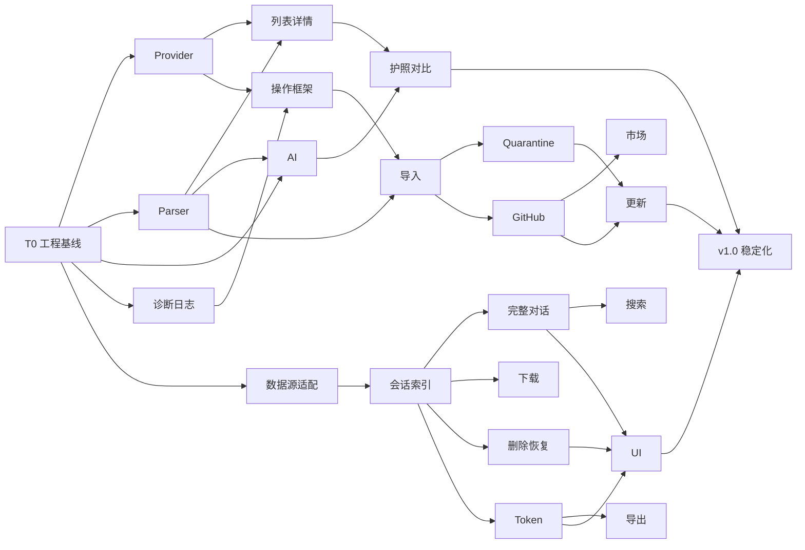

# Codex-O 实施计划

**版本**：v1.0-draft  
**基准日期**：2026-08-01
**状态**：待评审  
**上游基线**：`doc/产品蓝图与领域模型.md`  
**需求基线**：`doc/需求文档.md`  
**技术基线**：`doc/技术设计文档.md`

---

## 1. 当前状态

截至 2026-08-01：

- T0 工程与兼容基线、M1 看见与看懂已经完成。
- 已建立 Tauri 2 + React + Rust 正式工程、应用专属 SQLite、Provider、解析、Skill 列表/详情、AI 护照、设置和环境健康。
- 已完成 M2-S0 的业务埋点与日志中心初版，并由 M2-S0R 替换其日志存储实现。
- 日志写入和轮转由 `tauri-plugin-log` 独占；`SafeLogEvent` 仅保留为安全事件协议，`LogViewer` 负责只读解析。
- M2-S0R 已完成后，下一实施节点为 `M3-U1 数据源发现与能力探测`。

后续按 `PROGRESS.md` 的实际状态继续，不重做已经验收的 T0/M1。

---

## 2. 交付策略

按风险递增顺序交付：

```text
T0 工程与兼容基线
  -> M1 看见与看懂
  -> M2 可控管理
  -> M3 会话管理与使用洞察
  -> v1.0 稳定发布
```

每个阶段必须形成可运行版本，不允许把安全、回滚或兼容性集中到最后补齐。

---

## 3. 人力与估算口径

基准团队：

- 1 名 Rust/Tauri 工程师
- 1 名前端/全栈工程师
- 产品、设计、QA 兼职参与评审

估算单位为理想人天，不包含等待外部决策的时间。

| 阶段 | 估算 |
|---|---:|
| T0 工程与兼容基线 | 6 人天 |
| M1 看见与看懂 | 23 人天 |
| M2 可控管理 | 26.5 人天 |
| M3 会话管理与使用洞察 | 25 人天 |
| v1.0 稳定化 | 10 人天 |
| **合计** | **90.5 人天** |

两名工程师基准日历周期约 17 至 18 周，包含阶段评审、测试和缓冲。

---

## 4. 总体时间线

| 阶段 | 日期 | 交付 |
|---|---|---|
| T0 | 2026-07-28 至 2026-08-03 | 可运行空壳、数据库、Provider/Keyring/SQLite 技术验证 |
| M1 开发 | 2026-08-04 至 2026-08-28 | Skill 发现、解析、护照、AI、对比、设置 |
| M1 Beta | 2026-08-31 至 2026-09-04 | 真实 Skill 评测和问题修复 |
| M2 开发 | 2026-09-07 至 2026-10-13 | 插件诊断日志、导入、quarantine、恢复、GitHub/市场、更新 |
| M3 开发 | 2026-10-05 至 2026-10-30 | 完整会话预览、下载、删除、恢复、Token 和导出 |
| v1.0 稳定化 | 2026-11-02 至 2026-11-20 | 跨平台、兼容矩阵、安全和发布 |

日期是两名工程师的基准计划。若实际只有一名开发者，应按阶段顺序交付，不并行压缩。

---

## 5. T0：工程与兼容基线

**目标**：建立可持续开发基础，并提前验证最可能推翻架构的假设。

### T0-01 工程初始化，1.5d

- 初始化 Git 仓库
- 初始化 Tauri 2 + React + TypeScript + Vite
- 建立 Rust/前端目录边界
- 配置 lint、format 和基础 CI
- 接入现有 `prototype/` 作为视觉参考，不直接复制原型脚本

完成标准：

- macOS 开发模式可启动。
- CI 可执行 Rust 测试和前端静态检查。
- 不提交密钥或本机绝对路径。

### T0-02 自有 SQLite 与迁移，1d

- 建立由 Tauri `app_local_data_dir()` 解析的 Codex-O 自有 `data.db`
- 实现 migration runner
- 建立 providers/skills/snapshots/analyses 基础表
- 增加损坏数据库诊断路径

### T0-03 Provider 发现验证，1.5d

验证：

- `~/.agents/skills`
- 当前仓库 `.agents/skills`
- 历史兼容目录
- Plugin/Bundled Skill 的可发现信息

输出：

- Provider discovery spike
- 能力矩阵
- Q1 决策记录

### T0-04 Keyring 验证，0.75d

- macOS Keychain
- Windows Credential Manager 接口验证
- API Key 不进入 SQLite 和日志

### T0-05 Codex SQLite 兼容 fixture，1.25d

- 导出脱敏 schema fixture
- 建立当前 `threads` schema 测试
- 建立 `thread_dynamic_tools` 和 `thread_spawn_edges` 关联测试
- 覆盖 `PRAGMA foreign_keys=0`
- 增加 source 为 JSON 的 subagent fixture
- 增加缺失可选字段 fixture

### T0 Gate

以下任一项未通过，不进入 M1：

- Provider 无法稳定区分来源。
- Keyring 无法满足跨平台密钥存储。
- SQLite fixture 无法只读打开。
- 应用没有统一 AppError 和日志脱敏边界。

---

## 6. M1：看见与看懂

**目标**：用户不配置 AI 也能浏览 Skill；配置 AI 后获得可追溯 Skill 护照。

### S1 Provider Registry 与扫描，4d

| 子任务 | 估算 |
|---|---:|
| Provider 接口和能力模型 | 0.75d |
| User/Repo/Legacy Provider | 1d |
| System/Plugin/Bundled 只读适配 | 1d |
| 路径、symlink 和错误隔离测试 | 1.25d |

### S2 确定性解析与快照，5d

| 子任务 | 估算 |
|---|---:|
| YAML frontmatter 解析 | 0.75d |
| Markdown AST 和行号映射 | 1d |
| `agents/openai.yaml` 解析 | 0.5d |
| resources/scripts/references 清单 | 0.75d |
| 多文件 content hash | 0.5d |
| diagnostics 和 fixtures | 1.5d |

### S3 Skill 列表与详情，4d

- 应用壳和导航
- Skill 列表、搜索、筛选、排序
- Provider/权限/分析状态展示
- Skill 详情、资源树、原文按需读取
- 空、错误和只读状态

### S4 AI 分析引擎，6d

| 子任务 | 估算 |
|---|---:|
| AnalysisContextBuilder | 1d |
| 脱敏和 Prompt injection 防护 | 1d |
| SkillPassport JSON Schema | 0.75d |
| OpenAI-compatible 适配 | 0.75d |
| Anthropic/Ollama 适配 | 1d |
| 缓存、stale 和降级 | 1d |
| 批量队列与进度 | 0.5d |

### S5 Skill 护照、证据和对比，2.5d

- SkillPassport UI
- EvidenceRef 定位
- 风险和不确定性展示
- 两个 Skill 并排对比

### S6 设置与环境健康，1.5d

- AI 配置
- 测试连接
- 扫描根目录
- 隐私模式
- Provider 和数据源健康状态

### M1 验收

- 3 秒内展示静态 Skill 列表。
- 同名不同 Provider Skill 分别展示。
- 单个损坏 Skill 不阻塞扫描。
- AI 未配置时可查看完整静态信息。
- AI 输出 Schema 有效率达到 99%。
- 事实证据覆盖率达到 90%。
- 不存在写 Skill 的 IPC 命令。

### M1 Beta

使用至少三组样本：

1. 本机真实 Skill。
2. 故意损坏和异常结构 Skill。
3. 含提示注入、凭据形态和高风险脚本说明的 Skill。

人工评测维度：

- 是否能理解用途
- 是否能知道如何触发
- 是否能识别前置条件
- 是否能区分相似 Skill
- 是否能发现风险

---

## 7. M2：可控管理

**目标**：先建立用户可见但不泄密的诊断底座，再只对受管 User Skill 提供可恢复的生命周期操作。

### M2-S0 诊断与日志中心，2.5d（已完成，协议与埋点基线）

- 结构化安全事件、稳定事件 ID、错误码、恢复建议和首批业务埋点
- 设置页日志中心的信息架构、筛选、详情、导出和清空交互
- 现有 9 个一级路由保持不变

M2-S0 的自研日志 sink、额外日志授权和内存兜底由 M2-S0R 移除，不作为最终架构约束。

### M2-S0R 日志框架替换，5d（已完成）

- 引入 `tauri-plugin-log`、`log`、`@tauri-apps/plugin-log` 和 `log:default` capability。
- 将 `observability.rs` 拆为 `diagnostics/model.rs`、`emitter.rs`、`viewer.rs`、`commands.rs`。
- 插件独占 JSONL 落盘和轮转：2 MiB 单文件，当前 + 4 个归档；文件不可用时降级 stdout，不使用内存兜底。
- `SafeLogEvent` 使用 `deny_unknown_fields`、字段 allowlist、不可逆引用和长度校验；插件 formatter 拦截非法、超长和未知字段。
- `read_log_snapshot(query)` 作为唯一日志读取 command；支持损坏行、symlink、覆盖范围、cursor、逻辑清空和下次启动物理清理。
- 设置页日志中心始终可见，包含概览、诊断事件、系统日志、AI 解析日志、Skill / MCP 和导出诊断包；详情第三页签固定为“响应元数据（脱敏）”。

完成标准：

- 合法 SafeLogEvent 才能写入 JSONL；非法前端日志只产生 `frontend_log_rejected`，原始内容不落盘。
- 日志读取不接收前端路径，只识别约定文件名并拒绝 symlink、损坏行和超长行。
- 逻辑清空只写标记；物理清理在下次启动、插件打开前执行。
- 日志目录不可用时应用仍启动并显示“文件日志不可用”。
- 不记录 AI 原始响应、Prompt、请求体、API Key、Authorization、Token、绝对路径、环境变量、用户名、原始异常链、第三方响应正文或浏览器 console。

### M2-S1 三段式操作框架，3d

- OperationPlan
- selection token
- confirmation token
- 过期和重放保护
- 当前 hash 二次校验
- OperationPlanModal

### M2-S2 本地导入，3d

- 文件/目录选择
- 文件数量、大小、路径和格式验证
- 目标路径生成
- 同名冲突计划
- InstallReceipt

### M2-S3 Quarantine 与恢复，4d

- 同文件系统 rename
- 跨文件系统 copy/verify/remove
- partial 状态处理
- 恢复冲突
- quarantine 永久删除

### M2-S4 GitHub 安装，3d

- URL/ref/subdirectory 解析
- staging 下载
- 安装前静态验证
- commit SHA 记录
- 网络和限流错误

私有仓库认证只有在 Q4 决策后进入范围。

### M2-S5 市场 Provider，2d

- 市场数据适配
- 缓存缺失和字段变化
- 已安装状态匹配
- 复用 GitHub 安装流水线

### M2-S6 更新检查与更新，4d

- InstallReceipt 完整性检查
- remote/current/installed 三方 hash 对比
- 本地修改 conflict
- 更新计划和变更摘要
- 备份、替换、验证和回滚

### M2 验收

- 合法 SafeLogEvent 写入比例 100%，非法日志原始内容落盘率 0%。
- 日志、IPC、界面和导出敏感字段残留为 0。
- 日志目录不可用时应用保持可用并明确显示文件日志不可用。
- 所有写操作 100% 使用 plan/confirm/execute。
- 只读 Provider 写入测试全部拒绝。
- 导入后产生完整 InstallReceipt。
- quarantine 和恢复成功率 100%。
- 更新失败可恢复到操作前内容。
- 未知来源 Skill 不显示可更新。

---

## 8. M3：会话管理与使用洞察

**目标**：完整展示用户与助手的全部可见对话，支持原始 rollout 下载和可恢复删除，并提供兼容、可解释的 Token 分析。

### U1 数据源发现与能力探测，3d

- `state_*.sqlite` 发现优先级
- read-only 连接
- `PRAGMA table_info`
- schema fingerprint
- capabilities DTO

### U2 会话列表与详情，3d

- 项目分组
- 分页、筛选、排序
- 原始模型和来源
- Git 信息

### U3 完整对话解析，3d

- event_msg user_message/agent_message
- response_item message 兼容回退
- commentary/final_answer phase
- 重复事件去重
- 无效 JSON 行 warning
- cursor 分页
- 超长会话虚拟滚动

### U4 原始 rollout 下载，1.5d

- session ID 间接定位文件
- sessions/archived_sessions 根目录校验
- 系统保存对话框
- 源/目标 SHA-256 一致性验证

### U5 安全删除与恢复，5d

- SessionOperation plan/confirm/execute
- threads 完整行备份
- thread_dynamic_tools 显式处理
- thread_spawn_edges 父子影响预览
- 未知关联表禁用删除
- 最近活跃会话阻断
- rollout 移入 session-trash
- SQLite 事务删除
- 双向回滚
- 最近删除、恢复和永久清理

### U6 搜索，1.5d

- title/preview/first_user_message
- 缺字段降级
- 已加载完整对话页内搜索
- 高亮和详情跳转

### U7 Token 聚合与归一化，3.5d

- 总览
- 项目/模型/来源/时间分组
- 日/周/月趋势
- Top N
- subagent source 解析
- normalizer version

### U8 快照与导出，2d

- 一致性查询
- 可选 SQLite backup 快照
- CSV UTF-8 BOM
- JSON 原始和归一化字段
- 查询口径 metadata

### U9 会话和统计 UI，2.5d

- 对齐现有会话和 Token 原型
- 将 JSONL 前几行预览改成完整用户/助手对话时间线
- 保留下载原始 rollout
- 增加删除影响预览、最近删除和恢复
- 移除归档入口
- 删除虚构输入/输出拆分
- 兼容性和口径提示

### M3 验收

- 当前 66 条量级数据 2 秒内查询完成。
- `source` JSON 值不导致失败。
- 缺少 model/preview 等可选字段时仍可使用。
- 完整预览包含全部用户和助手可见消息。
- 默认不展示 developer、reasoning 和工具事件。
- 下载文件与源 rollout hash 一致。
- 删除同步处理 threads、关联表和 rollout。
- `foreign_keys=0` 时删除仍保持一致。
- 删除失败可恢复文件和数据库行。
- 未知关联表或活跃会话自动禁用删除。
- 导出包含快照时间、schema fingerprint 和归一化版本。

---

## 9. v1.0：稳定化与发布

### R1 跨平台，3d

- macOS Apple Silicon
- macOS Intel 构建验证
- Windows x64
- Linux 作为非阻塞实验目标

### R2 安全审计，2d

- 路径遍历
- symlink
- Zip Slip
- confirmation token
- Prompt injection
- 日志脱敏
- API Key 存储

### R3 兼容矩阵，1.5d

- 多种 Skill frontmatter
- 有/无 `agents/openai.yaml`
- 多种 Provider
- 至少三种 threads schema fixture
- 简单和 JSON source

### R4 性能和稳定性，1.5d

- 200 个 Skill
- 1000 条会话
- AI 中断和恢复
- 数据库 busy
- quarantine partial

### R5 发布工程，2d

- 应用签名
- GitHub Releases
- Tauri Updater
- Release Notes
- 用户安装和隐私说明

### v1.0 发布 Gate

- P0/P1/P2 验收全部通过。
- Critical 和 High 安全问题为 0。
- 无数据丢失缺陷。
- AI 不可用时 Skill 浏览可用。
- Codex 数据源不可用时 Skill 产品域可用。
- 所有文档与最终实现同步。

---

## 10. 依赖关系



M3 后端可以在 M2 后半段并行启动，但交付顺序保持 M2 后 M3。

---

## 11. 风险登记

| 风险 | 等级 | 处理 |
|---|---|---|
| Plugin/Bundled Skill 发现规则变化 | 高 | Provider 隔离；T0 提前验证；失败时支持 Additional Root |
| Codex 内部 SQLite schema 变化 | 高 | 动态探测；fixture；能力级降级 |
| 会话删除造成索引和文件不一致 | 高 | 完整备份；事务；显式关联表；双向回滚 |
| 活跃会话被 Codex 重新写回 | 高 | updated_at/hash 校验；活跃阻断；提交后复查 |
| rollout 事件格式变化 | 高 | event_msg 优先；response_item 回退；warning 隔离 |
| AI 护照事实幻觉 | 高 | 确定性事实输入；证据校验；uncertainties |
| Skill 内容提示注入 | 高 | 数据边界 Prompt；不执行；Schema；对抗样本 |
| Quarantine 跨文件系统失败 | 高 | copy/verify/remove；partial 不删备份 |
| GitHub/市场来源不稳定 | 中 | staging；InstallReceipt；Provider adapter |
| Windows Keyring 差异 | 中 | T0 spike；失败则阻塞发布 |
| 原型范围大于首版实现 | 中 | 页面保留 Roadmap；不模拟成功 |
| AI Provider 兼容差异 | 中 | 统一接口；Provider fixture；错误分类 |
| 费用口径被误解 | 中 | 默认关闭，不进入 v1.0 必需范围 |

---

## 12. 决策 Gate

| 决策 | 截止日期 | 负责人 |
|---|---|---|
| Q1 Plugin/Bundled 发现方式 | 2026-08-03 | 技术 |
| Q2 AI 默认发送范围 | 2026-08-07 | 产品 + 技术 |
| Q3 相似 Skill 基础算法 | 2026-08-14 | 技术 |
| Q4 私有 GitHub 认证是否进入 M2 | 2026-09-07 | 产品 |
| Q5 市场 Provider 数据源 | 2026-09-11 | 技术 |
| Q6 Keyring 跨平台方案 | 2026-08-03 | 技术 |
| Q7 SQLite 自动发现优先级 | 2026-10-05 | 技术 |

未按期决策时采用最小降级方案：

- Provider 不可自动发现则使用 Additional Root。
- 私有 GitHub 不进入 M2。
- 市场不可用不阻塞本地/GitHub 安装。
- 费用估算继续关闭。

---

## 13. 测试和交付要求

每个任务完成必须同时具备：

- 实现
- 正常路径测试
- 至少一个错误路径测试
- 错误码和恢复建议
- 日志脱敏检查
- 对应文档更新

每个阶段发布前：

1. 运行 Rust 单元和集成测试。
2. 运行前端 lint/typecheck。
3. 执行阶段端到端清单。
4. 使用真实数据做查询、预览和下载冒烟测试；删除只用隔离 fixture。
5. 核对原型与实际能力差异。
6. 更新 PRD、技术设计和实施计划状态。

---

## 14. 一人开发方案

如果只有一名开发者：

- 不并行 M2 和 M3。
- M1 预计 6 至 7 周。
- M2 预计 5 至 6 周。
- M3 预计 6 周。
- v1.0 稳定化预计 3 周。
- 总周期约 22 至 24 周。

优先顺序不可调整：

```text
Provider + Parser
-> 静态列表和详情
-> AI Skill Passport
-> 管理操作
-> 会话和 Token
```

若必须进一步压缩，先移除：

1. Anthropic Provider
2. 市场 Provider
3. 相似 Skill 自动提示
4. SQLite backup 快照
5. Linux 构建

不得压缩：

- 路径安全
- Keyring
- 分析 Schema 和证据
- plan/confirm/execute
- quarantine 回滚
- SQLite 只读

---

## 15. 立即行动

### 2026-07-28

- [ ] 评审四份新版文档
- [ ] 确认两名工程师或一人开发模式
- [ ] 确认是否初始化 Git 仓库
- [ ] 启动 T0-01 工程初始化

### 2026-07-29 至 2026-08-03

- [ ] 完成 Provider discovery spike
- [ ] 完成 Keyring spike
- [ ] 建立 SQLite schema fixtures
- [ ] 冻结首批 IPC 和数据库 migration

### M1 第一周

- [ ] 完成 User/Repo/Legacy Provider
- [ ] 完成 SKILL.md 和 openai.yaml 基础解析
- [ ] 将现有 Skill 列表原型映射为 React 组件清单

---

*若实施计划与上游蓝图冲突，先修正文档再继续开发，不允许通过代码暗中改变产品边界。*
